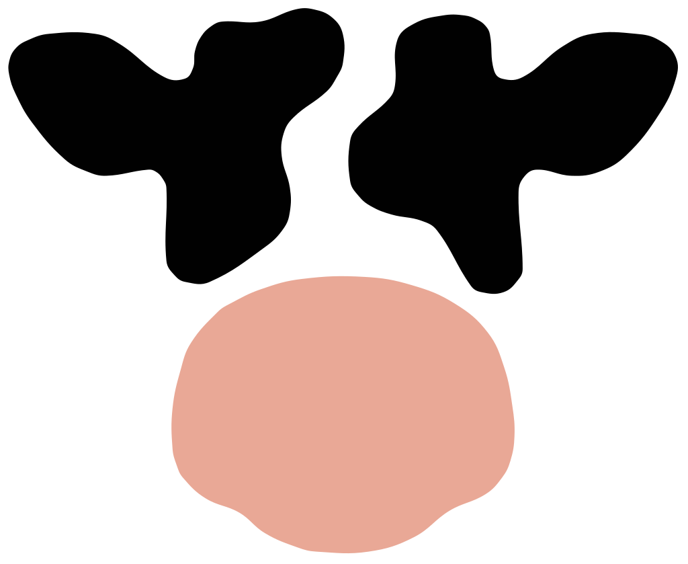

<!-- Header -->
  <p align="center">
    
  </p>

  <h1 align="center">Caw</h1>

  <p align="center">
    <i>Cloud agentic workspace</i>
  </p>
<!-- /Header -->

## Build

### Prerequisites
- [Go](https://go.dev/dl/) 1.21+
- [Node.js](https://nodejs.org/) 20+
- npm

### Frontend
```sh
cd src/frontend
npm install
npm run build
```

### Backend
From the repository root:
```sh
cd src

# Linux / macOS
go build -o ../caw ./cmd/caw/

# Windows
go build -o ../caw.exe ./cmd/caw/
```

Cross-compile from any platform:
```sh
cd src
GOOS=linux GOARCH=amd64 go build -o ../caw ./cmd/caw/
GOOS=windows GOARCH=amd64 go build -o ../caw.exe ./cmd/caw/
GOOS=darwin GOARCH=amd64 go build -o ../caw-macos ./cmd/caw/
```

## Contributing

See [CONVENTIONS.md](CONVENTIONS.md) for commit and branch naming conventions.
