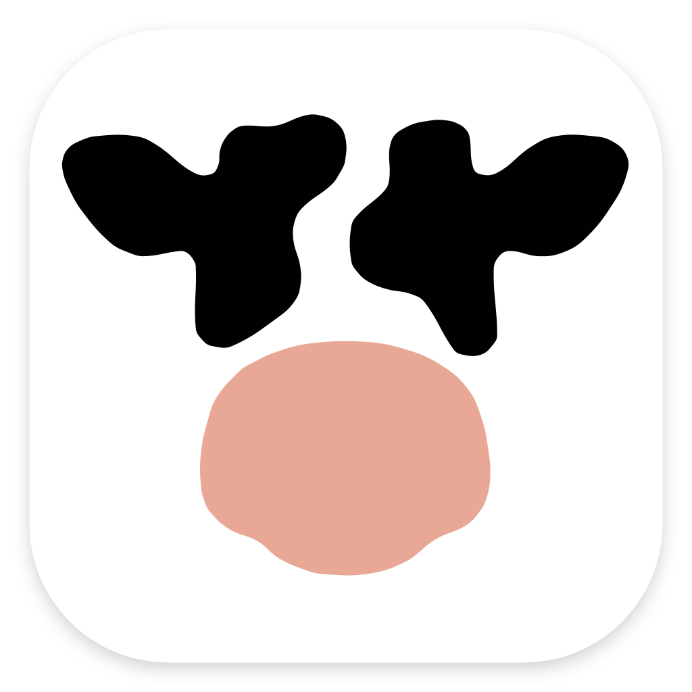
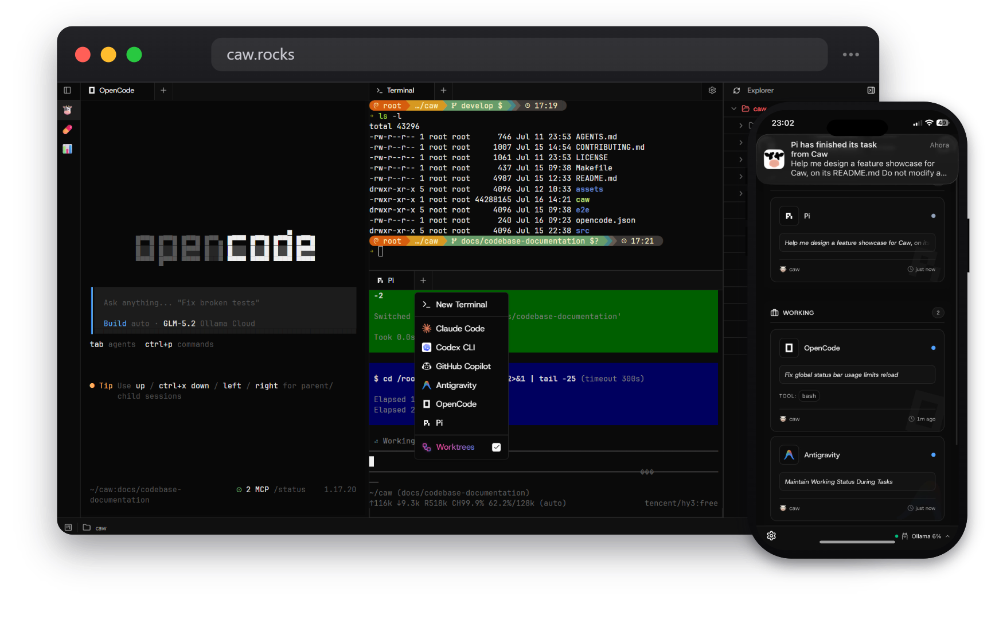

<!-- Header -->
  <p align="center">
    
  </p>

  <h1 align="center">Caw</h1>

  <p align="center">
    
    <a href="https://github.com/04mg/caw/stargazers"></a>
    
  </p>

  <p align="center">
    Web terminal multiplexer for AI agents.
  </p>

  <p align="center">
    
  </p>

## Features

<table>
<tr>
<td width="50%" valign="middle">

### Run Agents in the Browser

Launch Claude Code, Codex CLI, GitHub Copilot, OpenCode, Antigravity, Pi, Oh My Pi, or Hermes side-by-side — Caw auto-detects which agents are installed and spins up a terminal pane for each.

</td>
<td width="50%">
  <picture><source srcset="assets/feature-wall/multi-agent.gif" type="image/gif"></picture>
</td>
</tr>
<tr>
<td width="50%" valign="middle">

### Agent Control Center

Stop babysitting terminals. Caw watches each agent's transcript and shows its real-time state — Working, Needs Input, or Idle — on a live Kanban board.

</td>
<td width="50%">
  <picture><source srcset="assets/feature-wall/status-board.gif" type="image/gif"></picture>
</td>
</tr>
<tr>
<td width="50%" valign="middle">

### Parallel Git Worktrees

Each agent works in its own isolated git worktree and branch, created and cleaned up automatically — fan prompts across agents in parallel with zero file clashes.

</td>
<td width="50%">
  <picture><source srcset="assets/feature-wall/parallel-worktrees.gif" type="image/gif"></picture>
</td>
</tr>
<tr>
<td width="50%" valign="middle">

### Push Notifications

Walk away and stay in the loop. Get a push notification when an agent needs your input or finishes its task — on your desktop browser or on your phone.

</td>
<td width="50%">
  <picture><source srcset="assets/feature-wall/push-notifications.gif" type="image/gif"></picture>
</td>
</tr>
<tr>
<td width="50%" valign="middle">

### Usage Quota Monitoring

Keep an eye on your spend. Caw shows live usage limits and reset times for Claude, Codex, Copilot, Antigravity, OpenCode, Ollama, and OpenRouter.

</td>
<td width="50%">
  <picture><source srcset="assets/feature-wall/quota-monitoring.gif" type="image/gif"></picture>
</td>
</tr>
</table>

## Supported agents

Caw launches any CLI coding agent that runs in a terminal. These are detected on your machine and supported out of the box:

<p align="center">
   <b>Claude Code</b> &nbsp;&nbsp;
   <b>Codex CLI</b> &nbsp;&nbsp;
   <b>GitHub Copilot</b> &nbsp;&nbsp;
   <b>Antigravity</b> &nbsp;&nbsp;
   <b>OpenCode</b> &nbsp;&nbsp;
   <b>Pi</b> &nbsp;&nbsp;
   <b>Oh My Pi</b> &nbsp;&nbsp;
   <b>Hermes</b>
</p>

### Usage quota providers

Caw can show live usage limits and reset times for the following providers:

<p align="center">
   <b>Claude</b> &nbsp;&nbsp;
   <b>Codex</b> &nbsp;&nbsp;
   <b>GitHub Copilot</b> &nbsp;&nbsp;
   <b>Antigravity</b> &nbsp;&nbsp;
   <b>OpenCode</b> &nbsp;&nbsp;
   <b>Ollama</b> &nbsp;&nbsp;
   <b>OpenRouter</b>
</p>

## Supported commands

```
caw              Start the server (default)
caw update       Update caw to the latest release
caw version      Print the current version
caw help         Show available commands
```

Run `caw help` for the full list of flags, commands, and environment variables.

## Contributing

See [CONTRIBUTING.md](CONTRIBUTING.md) for commit and branch naming conventions.
